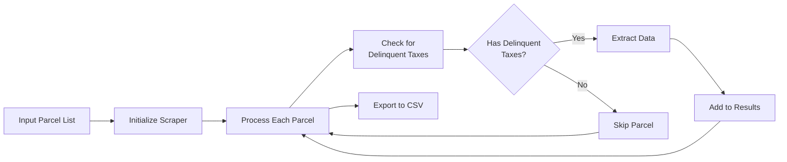
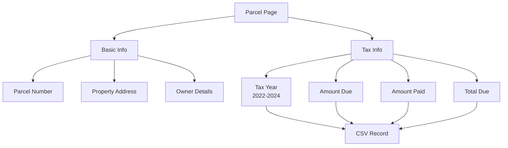
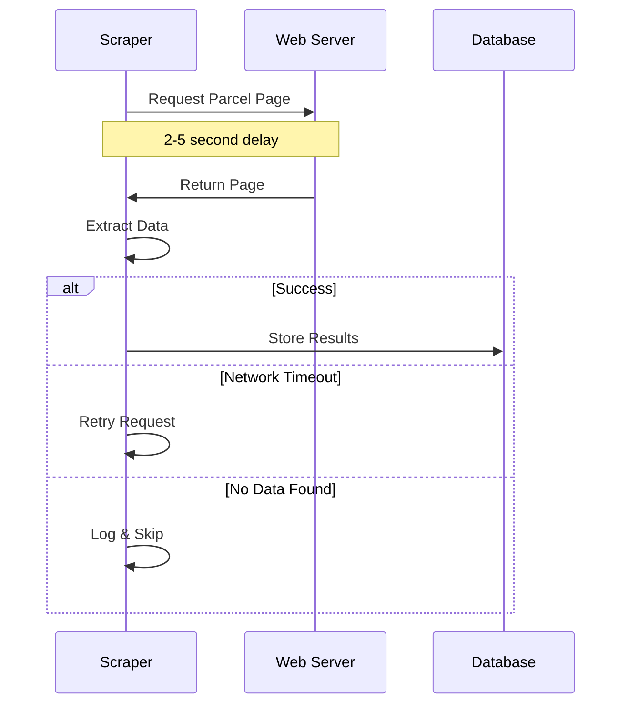

# Lancaster County Tax Delinquency Scraper

[](https://www.python.org/downloads/)
[](https://opensource.org/licenses/MIT)
[](https://playwright.dev/)

An automated Python script to extract delinquent tax information from Lancaster County, PA's public parcel viewer system.

## How It Works

### Overall Workflow


### Data Extraction Process


### Error Handling & Rate Limiting


## Features

- Automated scraping of delinquent tax data from Lancaster County's parcel viewer
- Handles multiple parcel numbers in batch
- Extracts data for tax years 2022-2024
- Collects property address and owner information
- Outputs results to CSV format
- Built-in rate limiting to prevent server overload
- Only captures parcels with actual delinquent taxes

## Data Extracted

For each parcel with delinquent taxes, the script collects:
- Parcel number
- Property address
- Owner information
- Tax year (2022-2024)
- Amount due
- Amount paid
- Total due
- Scrape date

## Prerequisites

- Python 3.7+
- Playwright
- Pandas

## Installation

1. Clone this repository:
```bash
git clone https://github.com/caesarw0/lancaster-property-tax-scraper.git
cd lancaster-property-tax-scraper
```

2. Install required packages:
```bash
pip install -r requirements.txt
```

3. Install Playwright browsers:
```bash
playwright install
```

## Usage

1. Prepare a list of parcel numbers in the script or import them from a file.

2. Run the script:
```bash
python src/property_scraper.py
```

The script will:
- Process each parcel number
- Extract delinquent tax information if available
- Save results to `output/delinquent_taxes.csv`

### Example Code

```python
from property_scraper import scrape_multiple_parcels

parcel_numbers = [
    "5408465600000",
    "1200794700000",
]

df = scrape_multiple_parcels(parcel_numbers)
```

## Rate Limiting

The script includes built-in delays between requests (2-5 seconds) to avoid overwhelming the server. This helps ensure:
- Ethical scraping practices
- Reduced likelihood of IP blocking
- Server resource conservation

## Output Format

The script generates a CSV file with the following columns:
- parcel_number
- address
- owner
- scrape_date
- tax_year
- amount_due
- amount_paid
- total_due

## Error Handling

The script includes robust error handling for:
- Network timeouts
- Missing data
- Invalid parcel numbers
- Server errors

## Legal Notice

This tool is designed for legitimate data collection from publicly available information. Users should:
- Review and comply with Lancaster County's terms of service
- Use reasonable request rates
- Respect the public resource

## Contributing

Contributions are welcome! Please feel free to submit a Pull Request.

## License

[MIT License](LICENSE)